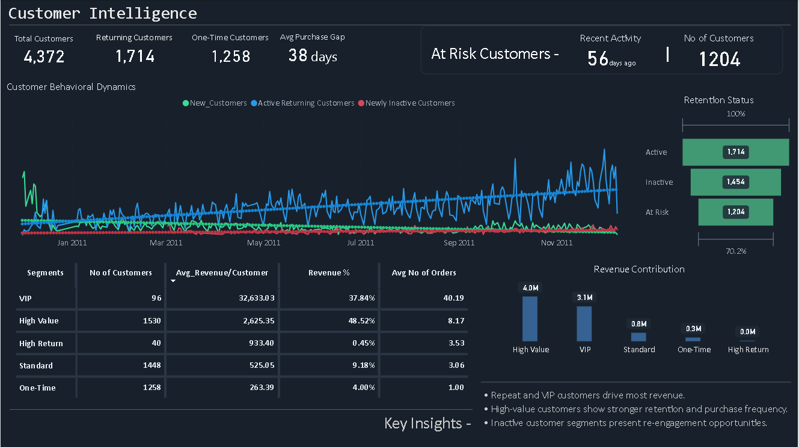

# customer-intelligence-dashboard
Customer Intelligence dashboard built using SQL and Power BI to analyze customer behavior,
retention patterns, sales trends, and revenue contribution across customer segments.

## Tools Used
- SQL (PostgreSQL)
- Power BI
- Excel

  ## Key Analysis Areas
- Customer Segmentation
- Retention & Repeat Customer Analysis
- Revenue Contribution Analysis
- Purchase Frequency Analysis
- Customer Lifecycle Trends
- Sales Performance Monitoring

  ## Dashboard Features
- KPI tracking for revenue, customer retention, and order frequency
- Customer segmentation based on purchasing behavior
- Analysis of at-risk and returning customers
- Interactive sales and customer trend visualization
- Revenue contribution analysis across customer groups

  ## Key Insights
- Returning customers contributed significantly higher revenue compared to one-time customers.
- VIP customer segments showed higher purchase frequency and stronger revenue contribution.
- A noticeable percentage of customers showed inactivity patterns, indicating retention opportunities.
- Customer purchasing behavior varied across time periods and sales trends.

## Dashboard Preview

